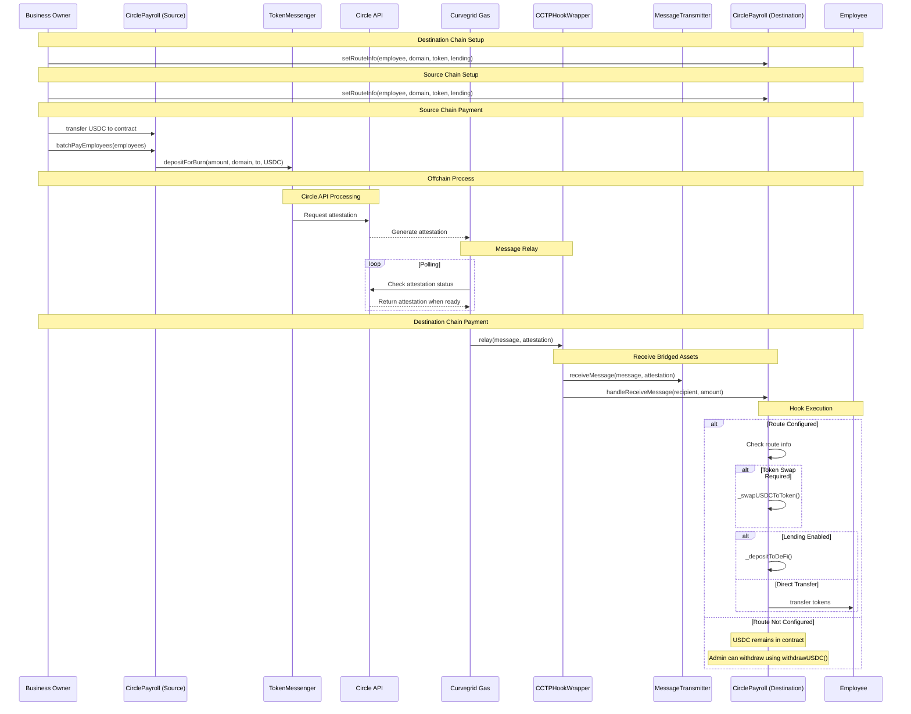

# Curvegrid Payroll

### Summaries for "Best Overall Use of MultiBaas" Prize.

#### 1. A one-sentence summary of your project
Curvegrid Payroll is a cross-chain payroll application facilitating USDC payments, leveraging Circle's Cross-Chain Transfer Protocol (CCTP) V2.

#### 2. How you used MultiBaas in your project

- MultiBaas REST API (directly or via SDK)
  - Seamlessly integrated MultiBaas REST API calls directly within Google Apps Script to manage smart contract interactions.
- Cloud Wallets
  - Secured contract ownership and management using a MultiBaas Cloud Wallet hosted on Azure Key Vault.
- Transaction Manager (TXM)
  - Leveraged TXM during the development phase for real-time, efficient monitoring of transaction statuses.
- Safe{Wallet}
  - Explored Safe{Wallet} integration for potential multisig security enhancements, confirming its value for future iterations.
- Event Queries
  - Utilized MultiBaas Event Queries via REST API from Google Apps Script to effectively track on-chain contract events.

#### 3. A brief intro to your team and their social handles

##### Natsuki Yamaguchi
X(Twitter): [0x_natto](0x_natto
)

##### Takuma Abe
X(Twitter): [takupesoo](https://x.com/takupesoo)

##### Yuta Tsurusaki
X(Twitter): [foxytanuki](https://x.com/foxytanuki)
Core Developer at [Mycel](https://www.mycel.land/). Full-stack blockchain developer passionate about intents and cross-chain solutions.

#### 4. Clear setup and testing instructions

##### Install dependencies

```
pnpm i
```

##### Deploy contracts

###### CCTPHookWrapper

```
pnpm deploy:hook --reset
```

###### MultichainPayrollMultisig

```
pnpm deploy:payroll-multisig --reset
```

#### 5. Your experience with MultiBaas (feedback, challenges, wins)

- **Wins:**
  - CloudWallet provided secure and convenient key management.
  - Responsive Support helped clarify best practices quickly.
  - The Contract Linking feature was remarkably intuitive and fast, significantly aiding the development workflow.
  - The ability to link already deployed contracts is a valuable feature.
  - The state overview in the "On-chain Contracts" section was extremely convenient during development, eliminating the need for manual `read` function calls.
  - Helpful input comments within the "Functions" tab of "On-chain Contracts" facilitated accurate parameter entry.
  - The flexibility to connect both Cloud Wallets and Web Wallets is a significant advantage.
  - The inclusion of Chainlist links when a connected Web Wallet doesn't support the deployment's chain was very helpful.
- **Challenges:**
  - CloudWallet setup on Azure Key Vault was somewhat complex initially.
  - Integrating with Safe{Wallet} proved challenging due to dependencies within the Safe{Wallet} ecosystem (e.g., SDKs), hindering straightforward integration.
  - Occasionally encountered an issue where contracts deployed using `hardhat-multibaas-plugin` were linked to an incorrect address within the MultiBaas UI, despite successful on-chain deployment.
- **Feedback:**
  - Simplified instructions or scripts for CloudWallet setup would be beneficial.
  - Proxy & Upgradable Contracts documentation could benefit from more detailed examples.
  - Provide clearer guidance or dedicated libraries/examples to simplify Safe{Wallet} integration, considering external dependencies.
  - Investigate and resolve the intermittent contract address mismatch issue in the MultiBaas UI after deployment with `hardhat-multibaas-plugin`.

---

## Commands

### Deploy Contracts via Hardhat Ignition

#### CCTPHookWrapper.sol

The following command will deploy CCTPHookWrapper to Hardhat local network.

```
pnpm deploy:hook
```

##### BaseSepolia

```
pnpm deploy:hook --network baseSepolia
```

##### Sepolia with verify

```
pnpm deploy:hook --network sepolia --verify
```

#### MultichainPayroll.sol

```
pnpm deploy:payroll
```

### WithHooks

1. `pnpm deploy:hook-v2 --verify`
2. `pnpm deploy:payroll-hook-destination --verify`
3. fill the values of MultichainPayrollWithHookSourceModule in `/ignition/parameters.json` 
4. `pnpm deploy:payroll-hook-source --verify`


### BatchPayEmployees from sepolia

```
➜  curvegrid-payroll git:(main) ✗ pnpm hardhat run scripts/payroll.ts --network sepolia
Running script on network: sepolia (chainId: 11155111)
Using deployer account: 0x39338FD37f41BabC04e119332198346C0EB31022

Getting deployed contract address for ID: MultichainPayrollModule#MultichainPayroll on chain 11155111...
  Reading deployed addresses from: /Users/foxy/Development/personal/hackathon/curvegrid-payroll/ignition/deployments/chain-11155111/deployed_addresses.json
  Found contract address: 0xa65552404dFc42380Bd1327C9795126F9a8626c1
Successfully retrieved MultichainPayroll contract instance.

Step 1: Setting route info for employee 0x45D17a2C9092ec9F86FB27A8416c2777858fB591...
  Transaction sent: 0x5399eb2c1b6046e33459c32fe0a0f70fdd574e75e5f22bffe2665edc5948b2a5
  Route info set successfully. Gas used: 50911

Step 2: Sending 0.2 USDC to Payroll contract (0xa65552404dFc42380Bd1327C9795126F9a8626c1)...
  Deployer (0x39338FD37f41BabC04e119332198346C0EB31022) USDC balance: 33.9
  USDC transfer transaction sent: 0xfc85a68caa3aeb505521e13721ebfbd439e96efde67ac8e1a948c4b0e5cd563e
  USDC transferred successfully. Gas used: 62159
  Payroll contract USDC balance: 0.2

Step 3: Paying employee 0x45D17a2C9092ec9F86FB27A8416c2777858fB591 (0.1 USDC) via batchPayEmployees...
 Payroll contract balance before payment: 0.2 USDC
  batchPayEmployees transaction sent: 0xa34ad7a4b3fc05db224157a42d1d677ea169f0f7178c035ea1e5a9640cdfea98
  Payment sent successfully via CCTP. Gas used: 135792
  Payroll contract USDC balance after payment tx: 0.1

Script finished successfully.
```

### Get an attestation

```
➜  curvegrid-payroll git:(main) pnpm tsx scripts/attestation.ts 0xa34ad7a4b3fc05db224157a42d1d677ea169f0f7178c035ea1e5a9640cdfea98
Retrieving attestation for transaction: 0xa34ad7a4b3fc05db224157a42d1d677ea169f0f7178c035ea1e5a9640cdfea98
Attestation retrieved successfully!

{
  attestation: '0xa28a1cbab7a4cc56235aea6066c21f0e3c2a66472a7ed00d7131afbbd671722f1ace7ceb158d013756d6b66b3b0cb4fc05125b61fe88b5a8cc29b299b26f806e1c13def4c37828096dac949b0a0b7b2775172662f6426095aa648aa86718975fd54e3fb2531d6ed1f44ea3691aebe3fe34a9830d3abccef34f9aca067eabd3c3f31b',
  message: '0x000000010000000000000006a482c6b74d999a4a814bb9a82bfbc98505808adce9db435556c451b5107ed45c0000000000000000000000008fe6b999dc680ccfdd5bf7eb0974218be2542daa0000000000000000000000008fe6b999dc680ccfdd5bf7eb0974218be2542daa0000000000000000000000000000000000000000000000000000000000000000000003e8000007d0000000010000000000000000000000001c7d4b196cb0c7b01d743fbc6116a902379c723800000000000000000000000045d17a2c9092ec9f86fb27a8416c2777858fb59100000000000000000000000000000000000000000000000000000000000186a0000000000000000000000000a65552404dfc42380bd1327c9795126f9a8626c100000000000000000000000000000000000000000000000000000000000000000000000000000000000000000000000000000000000000000000000000000000000000000000000000000000000000000000000000000000000000000000000',
  eventNonce: '0xa482c6b74d999a4a814bb9a82bfbc98505808adce9db435556c451b5107ed45c',
  cctpVersion: 2,
  status: 'complete'
}
```

### Receive Message on the destination chain

```
pnpm hardhat run scripts/2-receive-message.ts --network baseSepolia
Reading attestation data from: /Users/foxy/Development/personal/hackathon/curvegrid-payroll/attestation_data.json
Successfully read attestation data:
  Message: 0x000000010000000000000006a482c6b74d999a4a...
  Attestation: 0xa28a1cbab7a4cc56235aea6066c21f0e3c2a6647...

Running script on network: baseSepolia (chainId: 84532)
Using signer account: 0x39338FD37f41BabC04e119332198346C0EB31022

Getting deployed CCTPHookWrapper address for ID: CCTPHookWrapperModule#CCTPHookWrapper on chain 84532...
  Reading deployed addresses from: /Users/foxy/Development/personal/hackathon/curvegrid-payroll/ignition/deployments/chain-84532/deployed_addresses.json
  Found contract address: 0x36f6eb97FE0Ac332B651c46D08B201fE471C16e2
Successfully retrieved CCTPHookWrapper contract instance.

Calling receiveMessage on CCTPHookWrapper (0x36f6eb97FE0Ac332B651c46D08B201fE471C16e2)...
  Transaction sent: 0x3bb0ceab1685ba8e4cbcfccd28d4b4d53d6eb0f838e0560d881c8fa2c914da0a
  Message received successfully. Gas used: 184131
  View transaction on explorer: https://baseSepolia.etherscan.io/tx/0x3bb0ceab1685ba8e4cbcfccd28d4b4d53d6eb0f838e0560d881c8fa2c914da0a
```

## Architecture


