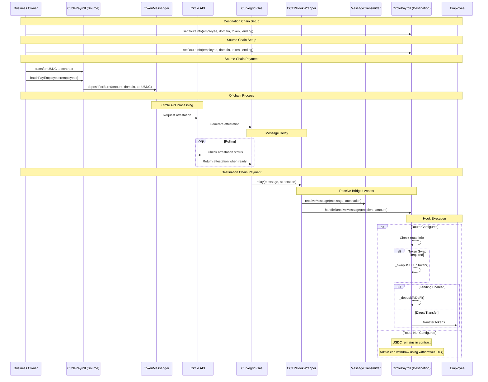

# Curvegrid Payroll

This application proceeds with Sepolia as the source chain and Base Sepolia as the destination chain.

## Commands

### Deploy Contracts via Hardhat Ignition

#### CCTPHookWrapper.sol

The following command will deploy CCTPHookWrapper to Hardhat local network.

```
pnpm deploy:hook
```

#### BaseSepolia

```
pnpm deploy:hook --network baseSepolia
```

## Architecture


